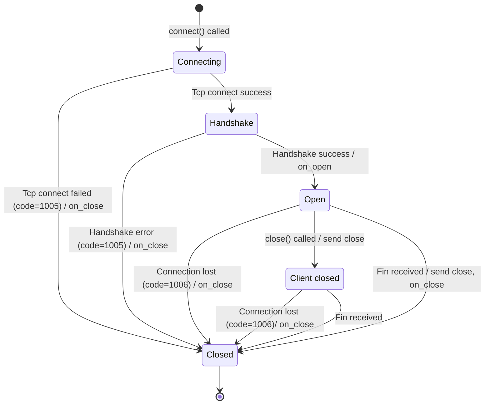
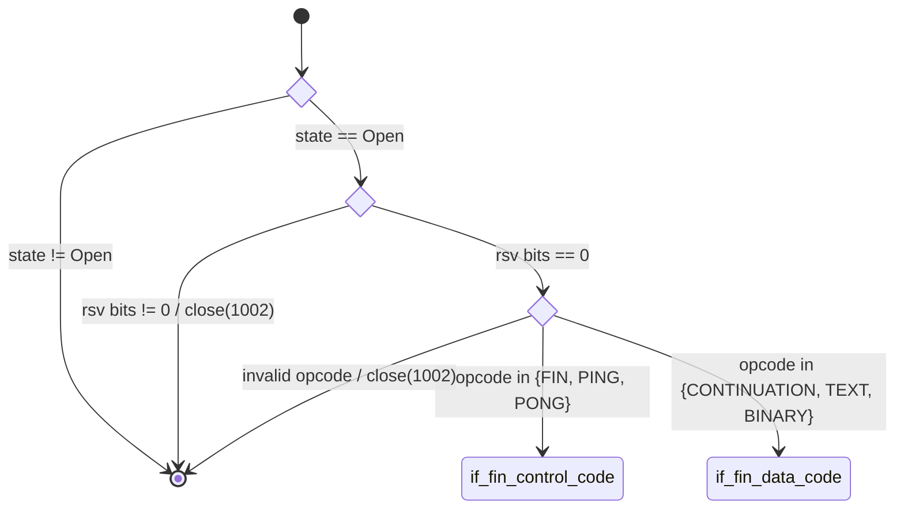

# Websocket client support
asyncpp-curl implements a basic websocket client on top of libcurl.

Highlevel state:

```mermaid
stateDiagram-v2
    ClientClosed: Client closed

    [*] --> Connecting : connect() called
    Connecting --> Closed : Tcp connect failed (code=1005) / on_close
    Connecting --> Handshake : Tcp connect success
    Handshake --> Closed : Handshake error (code=1005) / on_close
    Handshake --> Open : Handshake success / on_open
    Open --> Closed : Connection lost (code=1006) / on_close
    Open --> ClientClosed : close() called / send close
    ClientClosed --> Closed : Connection lost (code=1006)/ on_close
    ClientClosed --> Closed : Fin received
    Open --> Closed : Fin received / send close, on_close
    Closed --> [*]
```
Frame handling:

```mermaid
stateDiagram-v2
    state if_state <<choice>>
    state if_rsv_bits <<choice>>
    state switch_opcode <<choice>>
    [*] --> if_state
    if_state --> [*] : state != Open
    if_state --> if_rsv_bits : state == Open
    if_rsv_bits --> [*]: rsv bits != 0 / close(1002)
    if_rsv_bits --> switch_opcode : rsv bits == 0
    switch_opcode --> if_fin_control_code : opcode in {FIN, PING, PONG}
    switch_opcode --> if_fin_data_code : opcode in {CONTINUATION, TEXT, BINARY}
    switch_opcode --> [*] : invalid opcode / close(1002)
    
```